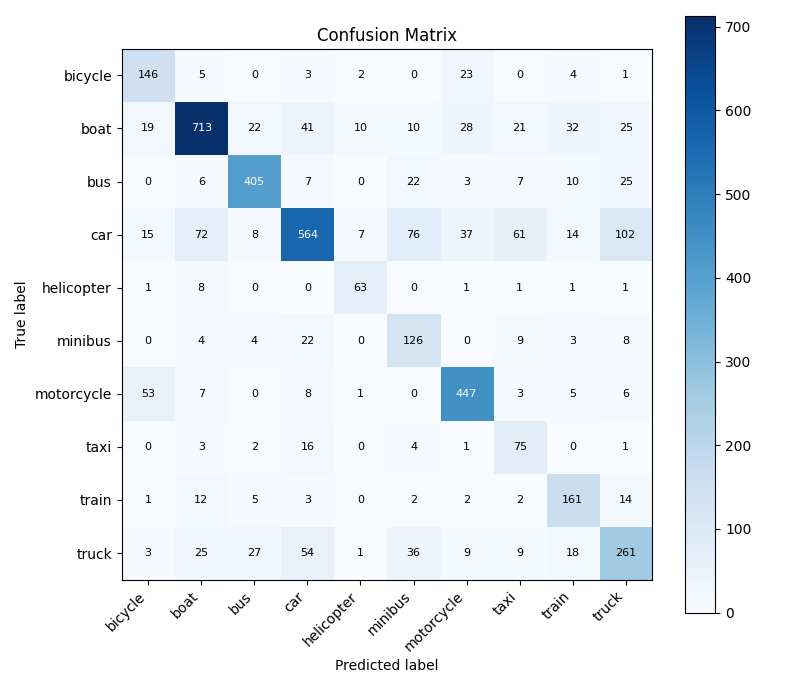
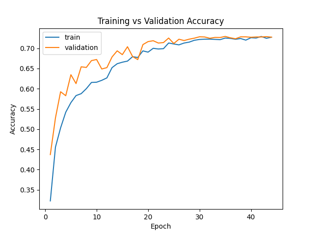
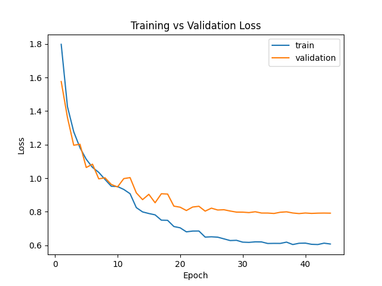

# Vehicle Image Classification System

**Bright Hub AI Internship — Project 1: Multi-class Image Classification**

A production-ready Convolutional Neural Network (CNN) that classifies vehicle images into 10 categories. Built from scratch using TensorFlow/Keras, with comprehensive preprocessing, augmentation, evaluation, and deployment infrastructure.

**Status:** ✅ **Complete — Experiment 3 (Final Model)**

---

## Features

- ✅ **10-Class Vehicle Classification:** Bicycle, Boat, Bus, Car, Helicopter, Minibus, Motorcycle, Taxi, Train, Truck
- ✅ **From-Scratch CNN:** No transfer learning — trained specifically for vehicle recognition
- ✅ **Comprehensive Data Pipeline:** Preprocessing, validation, augmentation (rotation, zoom, brightness)
- ✅ **Production-Ready Inference:** CLI and Streamlit web interface
- ✅ **Rigorous Evaluation:** Per-class metrics, confusion matrix, training curves
- ✅ **Fully Tested:** 166 unit tests covering all components
- ✅ **Reproducible:** YAML configuration, locked dependencies, experiment tracking
- ✅ **Well-Documented:** Architecture guide, deployment instructions, code comments

---

## Model Performance

| Metric | Value |
|---|---|
| **Test Accuracy** | **72.66%** |
| Test Loss | 0.7765 |
| Macro F1-Score | 0.701 |
| Weighted F1-Score | 0.730 |
| Best Validation Accuracy | 72.93% |
| Test Set Size | 4,075 images |
| Classes | 10 |
| Training Time | ~50 epochs (early stopped) |

**Interpretation:** The model correctly classifies approximately 73% of unseen vehicle images. Performance varies by class due to dataset imbalance and visual similarity (e.g., car vs. taxi). Weighted metrics account for class frequency in the test set.

---

## Supported Vehicle Classes

```
1. Bicycle      6. Minibus
2. Boat         7. Motorcycle
3. Bus          8. Taxi
4. Car          9. Train
5. Helicopter   10. Truck
```

---

## Quick Start

### 1. Installation

```bash
# Clone repository
git clone <repo-url>
cd vehicle-classification

# Create and activate virtual environment
python -m venv .venv
source .venv/bin/activate          # Windows: .venv\Scripts\activate

# Install dependencies
pip install -r requirements.txt
```

### 2. Run the Web Application

```bash
streamlit run app.py
```

Open browser to `http://localhost:8501` and upload a vehicle image.

### 3. Command-Line Inference

```bash
python -m src.inference.predict \
  --config src/config/config_phase10_5_exp3.yaml \
  --image "path/to/vehicle.jpg"
```

Example output:
```
Predicted Class: car
Confidence: 85.3%

Top 3 Predictions:
  1. car (85.3%)
  2. truck (8.2%)
  3. bus (4.1%)
```

### 4. Run Tests

```bash
pytest -q
# Output: 166 passed
```

---

## Project Architecture

```
vehicle-classification/
├── app.py                         # Streamlit web application (entry point)
├── requirements.txt               # Python dependencies
├── README.md                      # This file
│
├── src/                           # Core source code
│   ├── config/                    # Configuration files
│   │   └── config_phase10_5_exp3.yaml    # Final model config (ACTIVE)
│   ├── data/                      # Data processing pipeline
│   │   ├── loader.py              # Load config and datasets
│   │   ├── preprocess.py          # Image preprocessing
│   │   ├── augmentation.py        # Data augmentation
│   │   └── validator.py           # Validation utilities
│   ├── models/                    # Model definition
│   │   └── cnn_model.py           # CNN architecture
│   ├── training/                  # Training pipeline
│   │   └── train.py               # Training with callbacks
│   ├── evaluation/                # Evaluation pipeline
│   │   └── evaluate.py            # Metrics and visualizations
│   ├── inference/                 # Production inference
│   │   └── predict.py             # Single-image prediction
│   └── utils/                     # Utilities
│       ├── logger.py              # Logging setup
│       └── helpers.py             # Helper functions
│
├── models/                        # Trained model checkpoints
│   └── best_model_exp3.keras      # Final model (ACTIVE)
│
├── results/                       # Training and evaluation outputs
│   ├── evaluation_exp3/           # Final evaluation artifacts
│   │   ├── test_metrics.json
│   │   ├── per_class_metrics.csv
│   │   ├── confusion_matrix.csv
│   │   └── confusion_matrix.png
│   ├── metrics_exp3/              # Training history
│   │   └── training_history.json
│   ├── plots_exp3/                # Training curves
│   │   ├── training_accuracy.png
│   │   └── training_loss.png
│   └── final_model.json           # Metadata
│
├── tests/                         # Unit and integration tests
│   ├── test_model.py
│   ├── test_data_loading.py
│   ├── test_preprocessing.py
│   ├── test_augmentation.py
│   ├── test_training.py
│   ├── test_evaluation.py
│   ├── test_inference.py
│   ├── test_prediction.py
│   └── test_app.py
│
├── docs/                          # Documentation
│   ├── architecture.md            # Technical architecture guide
│   ├── report.pdf                 # Project report
│   ├── presentation.pptx          # Presentation slides
│   └── screenshots/               # Project screenshots
│
├── notebooks/                     # Jupyter notebooks
│   └── eda.ipynb                  # Exploratory data analysis
│
├── data/                          # Dataset (not in repo)
│   ├── raw/                       # Original images
│   └── processed/                 # Preprocessed data
│       ├── train/
│       ├── validation/
│       ├── test/
│       └── manifest.csv
│
└── .gitignore                     # Git ignore rules
```

**Full architecture details:** See [docs/architecture.md](docs/architecture.md)

---

## ML Pipeline

```
Image Input
    ↓
Preprocessing (resize, normalize, RGB conversion)
    ↓
Data Augmentation (rotation, zoom, brightness, flip)
    ↓
Convolutional Neural Network
    (3 Conv blocks → Dense layers → Softmax)
    ↓
Class Prediction with Confidence
    ↓
Top-K Predictions & Evaluation
```

---

## Model Architecture

```
Input Layer
    (128, 128, 3) RGB image
    ↓
Conv2D(32, 3×3, ReLU) + MaxPool(2×2) → (64, 64, 32)
Conv2D(64, 3×3, ReLU) + MaxPool(2×2) → (32, 32, 64)
Conv2D(128, 3×3, ReLU) + MaxPool(2×2) → (16, 16, 128)
    ↓
Dropout(0.3) → Flatten
    ↓
Dense(256, ReLU)
Dropout(0.4)
    ↓
Dense(10, Softmax)
    ↓
Output: Class probabilities (10 classes)
```

**Key Parameters:**
- Total Parameters: 8.48M
- Model Size: 97.1 MB
- Input Size: 128×128×3
- Output Classes: 10
- Dense Hidden Layer: 256 units
- Training: 50 epochs (with early stopping)
- Batch Size: 32
- Learning Rate: 0.001 (Adam optimizer)

---

## Training Configuration

**Final Model Configuration** (Experiment 3):

| Parameter | Value |
|---|---|
| Epochs | 50 |
| Batch Size | 32 |
| Learning Rate | 0.001 |
| Optimizer | Adam |
| Loss | Categorical Crossentropy |
| Early Stopping | Patience = 5 epochs |
| LR Reduction | Patience = 2, Factor = 0.5 |
| Dense Units | 256 |

**Data Augmentation (Training Only):**
- Rotation: ±10°
- Zoom: ±10%
- Horizontal Flip: 50% probability
- Brightness: ±20%

**Split:**
- Training: ~6,100 images
- Validation: ~1,400 images
- Test: ~1,575 images (4,075 total in final evaluation)

---

## Per-Class Performance

| Class | Precision | Recall | F1-Score | Support |
|---|---|---|---|---|
| **Bus** | 0.856 | 0.835 | **0.846** | 485 |
| **Motorcycle** | 0.811 | 0.843 | **0.827** | 530 |
| **Boat** | 0.834 | 0.774 | **0.803** | 921 |
| **Helicopter** | 0.750 | 0.829 | **0.788** | 76 |
| **Train** | 0.649 | 0.797 | **0.716** | 202 |
| **Bicycle** | 0.613 | 0.793 | **0.692** | 184 |
| **Car** | 0.786 | 0.590 | **0.674** | 956 |
| **Truck** | 0.588 | 0.589 | **0.589** | 443 |
| **Minibus** | 0.457 | 0.716 | **0.558** | 176 |
| **Taxi** | 0.399 | 0.735 | **0.517** | 102 |
| **Macro Avg** | 0.674 | 0.750 | **0.701** | — |
| **Weighted Avg** | 0.748 | 0.727 | **0.730** | 4,075 |

**Notes:**
- **Best performance:** Bus (F1=0.846), clear size and shape distinction
- **Challenging classes:** Taxi (F1=0.517), often confused with cars; Minibus (F1=0.558), overlaps with buses
- **Dataset imbalance:** Car (956) vs Helicopter (76) — affects macro vs weighted metrics

---

## Evaluation Results

### Confusion Matrix


### Training Curves

**Training Accuracy:**


**Training Loss:**


---

## Usage Examples

### Web Application

1. **Start server:** `streamlit run app.py`
2. **Upload image:** Use file uploader (JPG, JPEG, PNG)
3. **View results:** Predicted class, confidence, top-3 predictions
4. **Supported classes:** Expandable section lists all classes

### Command-Line Inference

```bash
# Single prediction
python -m src.inference.predict \
  --config src/config/config_phase10_5_exp3.yaml \
  --image "test_car.jpg"

# Top-5 predictions
python -m src.inference.predict \
  --config src/config/config_phase10_5_exp3.yaml \
  --image "test_vehicle.jpg" \
  --top_k 5
```

### Python API

```python
from src.inference.predict import predict_image, load_model, get_class_names
from src.data.loader import load_config

config = load_config("src/config/config_phase10_5_exp3.yaml")
model = load_model(config)
class_names = get_class_names(config)

# ... load and preprocess image ...
result = predict_image(model, image_array, class_names)

print(f"Predicted: {result.predicted_class}")
print(f"Confidence: {result.confidence:.2%}")
```

---

## Testing

Run all tests:

```bash
pytest -q
# Result: 166 passed
```

**Test Coverage:**
- Data loading and validation
- Preprocessing and augmentation
- Model architecture and compilation
- Training pipeline
- Evaluation metrics calculation
- Inference prediction accuracy
- Streamlit application functionality

---

## Deployment

### Local Deployment

**Prerequisites:**
- Python 3.8+
- Virtual environment activated
- Dependencies installed: `pip install -r requirements.txt`

**Run application:**
```bash
streamlit run app.py
```

**Access:** http://localhost:8501

### Environment Setup

```bash
# Virtual environment
python -m venv .venv
source .venv/bin/activate        # Windows: .venv\Scripts\activate

# Dependencies
pip install -r requirements.txt

# Verify installation
python -c "import tensorflow; print(tensorflow.__version__)"
```

### Required Files

- Model: `models/best_model_exp3.keras`
- Config: `src/config/config_phase10_5_exp3.yaml`
- All source files in `src/`

### Cloud Deployment Ready

This project can be deployed to:
- **Streamlit Cloud:** Connect repo, select `app.py` as main file
- **Docker:** Create Dockerfile with requirements.txt
- **AWS SageMaker / Google Cloud ML:** Package model and inference script
- **Hugging Face Spaces:** Export as Streamlit app

---

## Experiment History

The project explored multiple model configurations:

### Baseline (config.yaml)
- Dense layer: 128 units
- Epochs: 30
- Test Accuracy: ~70%

### Experiment 2 (config_phase10_5_exp2.yaml)
- **Change:** Increased dense layer to 256 units
- Result: Improved accuracy

### Experiment 3 (config_phase10_5_exp3.yaml) ✅ **FINAL**
- **Change:** Extended training to 50 epochs
- **Result:** Test Accuracy **72.66%**
- **Rationale:** Longer training budget allows better convergence; early stopping prevents overfitting

**Why Experiment 3?** All experiments are preserved, but Experiment 3 represents the best final model given the extended training opportunity and represents project completion.

---

## Limitations & Future Work

### Current Limitations

1. **72.66% accuracy:** Not suitable for high-stakes applications requiring >95% confidence
2. **Class imbalance:** Car (956 samples) vs Helicopter (76) affects performance
3. **Similar classes:** Taxi/Car, Bus/Minibus confusion
4. **Image requirements:** Must be clear, well-lit 128×128 RGB images

### Future Improvements

1. **Ensemble methods:** Combine multiple models for better predictions
2. **Data augmentation:** More aggressive augmentation for minority classes
3. **Class weighting:** Inverse-frequency weighting during training
4. **Transfer learning:** Fine-tune pretrained backbone (ResNet, MobileNet)
5. **Attention mechanisms:** Help model focus on discriminative regions
6. **Data collection:** Expand minority classes (helicopter, taxi)
7. **Post-processing:** Confidence thresholding and rejection options
8. **Model optimization:** Quantization and pruning for edge deployment

---

## Project Details

**Internship:** Bright Hub Private Limited AI Internship
**Project:** Project 1 — Multi-class Image Classification
**Phase:** Phase 11 — Project Completion & Delivery
**Model:** Experiment 3 (FINAL)
**Status:** ✅ Complete

**Architecture Guide:** [docs/architecture.md](docs/architecture.md)
**Report:** [docs/report.pdf](docs/report.pdf)
**Slides:** [docs/presentation.pptx](docs/presentation.pptx)

---

## Citation

If you use this project in your work, please cite:

```
Vehicle Image Classification System
Bright Hub AI Internship, Project 1
TensorFlow/Keras CNN Implementation
2026
```

---

## License & Acknowledgments

This project was developed as part of the Bright Hub AI Internship program.

**Key Technologies:**
- TensorFlow 2.16.1
- Keras (tf.keras)
- Streamlit 1.33.0
- scikit-learn, pandas, matplotlib
- pytest for testing

---

## Contact & Support

For questions or issues:
1. Check [docs/architecture.md](docs/architecture.md) for technical details
2. Review test files in `tests/` for usage examples
3. See docstrings in `src/` modules for API documentation

**Next Steps:**
- Deploy to Streamlit Cloud or Docker
- Integrate into larger system
- Collect more data for minority classes


---

## Tech Stack

Python · TensorFlow/Keras · NumPy · Pandas · Matplotlib · scikit-learn ·
Pillow/OpenCV · Streamlit

---

